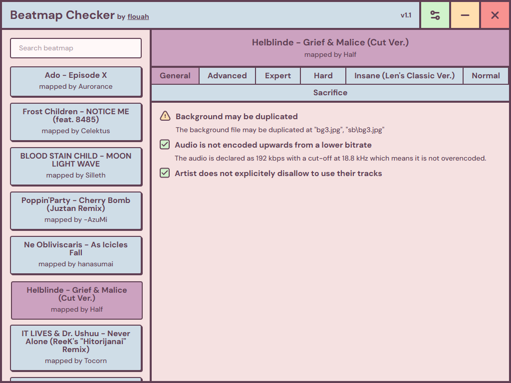

<div align="center">
  <h1>Beatmap Checker</h1>
	
	<br>
	<b>A tool to check osu! beatmaps</b>
	<br>
	<br>
	
</div>

## Disclaimer

Beatmap Checker is actively being updated, and feedback is appreciated. If you want to contribute by suggesting new features or reporting issues, please message me on discord (flouah) or [in-game](https://osu.ppy.sh/community/chat?sendto=8030129).

## Installing

> [!WARNING]
> This application can only be used in Windows. I plan on adding macOS and Linux support in the future.

Head over to the [releases](https://github.com/flouah4/osu-beatmap-checker/releases) section and choose your preferred installer method (portable or setup).

## Available checks

### General

- [Overencoded audio](https://osu.ppy.sh/wiki/en/Ranking_criteria#:~:text=not%20be%20encoded%20upwards%20from%20a%20lower%20bitrate%20or%20sampling%20rate)
- [Video encoder](https://osu.ppy.sh/wiki/en/Ranking_criteria#video-and-background:~:text=A%20video%20must%20be%20encoded%20in%20H.264)
- [Video dimensions](https://osu.ppy.sh/wiki/en/Ranking_criteria#video-and-background:~:text=A%20video%27s%20dimensions%20must%20not%20exceed%20a%20width%20of%201280%20and%20a%20height%20of%20720%20pixels)
- [Video audio track](https://osu.ppy.sh/wiki/en/Ranking_criteria#video-and-background:~:text=A%20video%27s%20audio%20track%20must%20be%20removed%20from%20the%20video%20file)
- Video offset is not default (0)
- Background file is not duplicated in storyboard
- [Disallowed artist](https://osu.ppy.sh/wiki/en/Rules/Content_usage_permissions#:~:text=Featured%20Artist%20listing.-,Disallowed,-Artist)
- Missing source when title uses markers like TV Size

### Difficulty

#### Standard

- [Epilepsy warning](https://osu.ppy.sh/wiki/en/Ranking_criteria#video-and-background:~:text=Difficulties%20that%20contain%20repetitive%20strobes%2C%20pulsing%20images%2C%20or%20rapid%20changes%20in%20contrast%2C%20brightness%20or%20colour%20in%20the%20storyboard%20or%20video%20must%20use%20an%20epilepsy%20warning)
- [Widescreen support](https://osu.ppy.sh/wiki/en/Ranking_criteria#video-and-background:~:text=The%20Widescreen%20support%20setting%20should%20be%20turned%20on%20if%20the%20difficulty%20contains%20a%20widescreen%20storyboard)
- Letterbox during breaks is enabled
- Samples match playback rate is enabled
- Custom preferred skin is selected
- Enable custom colors is unchecked
- [1/1 sliders with multiple reverses on Easy difficulties](https://osu.ppy.sh/wiki/en/Ranking_criteria/osu%21#easy:~:text=Avoid%201/1%20sliders%20with%20multiple%20reverses) [^1]
- [1/2 sliders with multiple reverses on Normal difficulties](https://osu.ppy.sh/wiki/en/Ranking_criteria/osu%21#easy:~:text=Avoid%201/2%20sliders%20with%20multiple%20reverses) [^1]

[^1]: Assuming 180 BPM

## Node.js version

22.17.0

## Building from source

```bash
npm run dev
npm run electron
```

## Packaging

```bash
npm run pack
```